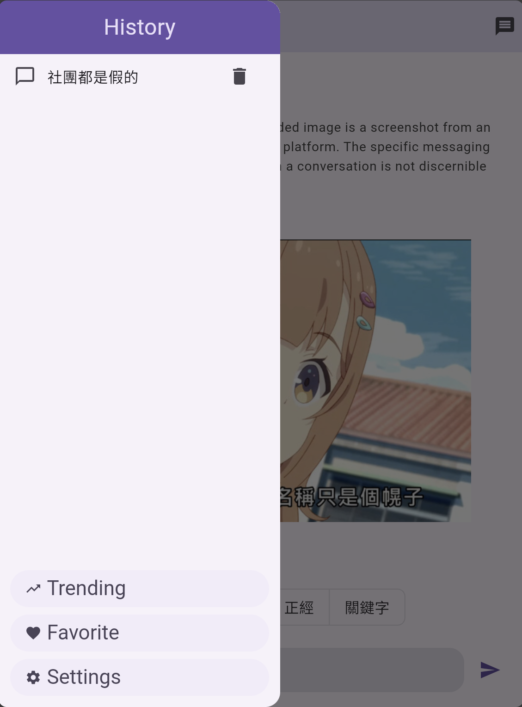
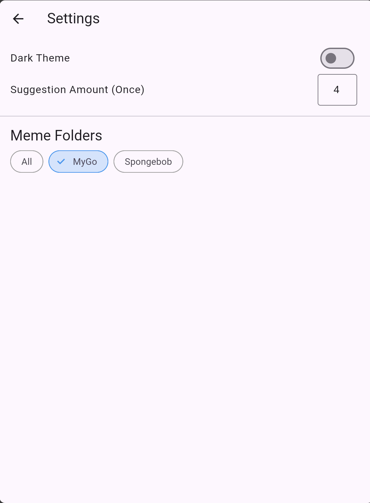

# 2025 Software Studio Final Project - AI Meme Suggestor App

## Project Overview
**AI Meme Suggestor** is an AI-powered Flutter app designed to help users find appropriate memes for different situations—even if they’re not familiar with meme culture.

We built an AI flow that balances quality and speed. In our experiments, users typically receive the first suggestion in under a minute. The results are relevant and often genuinely funny and usable.

## Features
- Situation analysis & idea generation using Gemini 2.5 Flash
- Meme retrieval via Retrieval-Augmented Generation (RAG)
- LLM-based meme selection and reasoning
- Iterative suggestions based on user feedback
- Agentic behavior: automatic adjustment if intent changes
- Quick copy-paste, favorite saving, trending memes
- Customizable meme sources

## Tech Stack
- **Frontend:** Flutter (Dart)
- **Backend:** Firebase
- **AI Integration:** Google Gemini API, OpenAI API (RAG)

## How to Run
The setup requires Firebase and API key configuration. Since the app is not production-ready, we provide a demo video instead:

🎥 [Demo Video Link](https://youtu.be/7hoyjsxSasg)

## Work Distribution

- **112060028 吳彥儒**: Team Lead, AI Flow, Firebase, UI/UX, Functionality
- **112060033 廖昱瑋**: Idea, UI/UX, Functionality
- **112062219 呂宣陽**: UI/UX, Functionality
- **112062213 張辰維**: UI/UX, RAG

### Screenshots

## License
All rights reserved.
